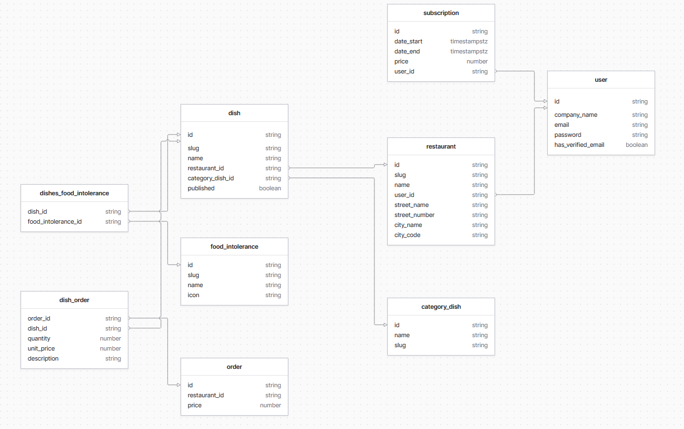

# QR Restaurant

Platform where a restaurant owner create the menu for his restaurants. The menu is generate with a QR code for the customers. The client can now scan the code to see the menu and make a order.

## Technologies

-   Back - NestJS => TypeORM/PSQL
-   Front - NextJS => TailwindCSS/HeadlessUI

## Features V1 - Dashboard

[Figma](https://www.figma.com/file/hcWEVuMRzAMyamRS0YhPcF/QR_payment?node-id=0%3A1)

-   Authentication

    -   User must verifiy email to access features in dashboard
    -   User can see only his restaurants

-   Create restaurant one or more per user

    -   Name
    -   Street
    -   ...

-   Create dishes

    -   Name
    -   Description
    -   Select category => Starter, main dishes, dessert, drink, ... (Only One)
    -   Select food intolerance => Vegan, Only Meat, ... (Many can be selected)
    -   (PROMO)

-   Generate QR Code for the menu

## Features V1 - Client

-   Scan QR Code
-   Add products to cart
-   Write little description for some information about the order
    [Front Design](https://www.figma.com/file/hcWEVuMRzAMyamRS0YhPcF/QR_payment?node-id=0%3A1)
-   Stripe Test Payment (Not connect to dashboard account)

## Schema DB

